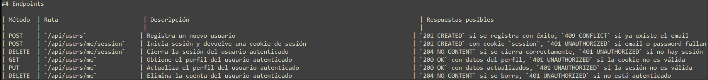

# p5

En este repositorio encontrará la solución propuesta a la práctica 5 de PAT. En ella se ha detallado cada una de las soluciones proporcionados a los TODO.
Durante la realización de la práctica la verdad es que he consolidado mucho conocimiento acerca de la persistencia de datos y del uso de las pruebas unitarias
o de integración, e incluso las pruebas a nivel de frontend con el .cy. El proyecto me ha dado una visión general (al ver que todos los archivos, que son unos cuantos, están "conectados" y como se coordinan entre sí) pero también particular (se tocan muchos lenguajes de programación y se realizan muchas tareas diferentes entre sí)
La verdad que ha sido una práctica completamente útil para mi aprendizaje de la asignatura. A continuación voy a poner la tabla del primer todo, ya que no me dejaba editar el .md que habías proporcionado en el proyecto. 

